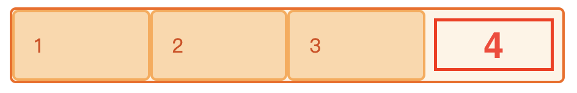

### 网格布局

MDN 里对 grid 的介绍和对比其他布局讲解的十分详细，想仔细学习的建议点进下面的链接

[网格布局的基本概念](https://developer.mozilla.org/zh-CN/docs/Web/CSS/CSS_Grid_Layout/Basic_Concepts_of_Grid_Layout)

[grid layout 和其它布局方法的联系](https://developer.mozilla.org/zh-CN/docs/Web/CSS/CSS_Grid_Layout/Relationship_of_Grid_Layout)

下面部分是我对链接里重要内容的截取，以及自己的理解

##### 1. CSS 网格布局和弹性盒布局的区别

**CSS 网格布局**和**弹性盒布局**的主要区别在于[弹性盒布局](https://developer.mozilla.org/zh-CN/docs/Web/CSS/CSS_Flexible_Box_Layout)是为一维布局服务的（沿横向或纵向的），而网格布局是为二维布局服务的（同时沿着横向和纵向）。这两个规格有一些相同的特性。如果你已经掌握如何使用弹性盒布局的话，你可能会想知道这些相似之处怎样在能帮助你掌握网格布局

CSS 网格在对 row 进行控制的同时，还能控制 column，而弹性盒只能控制 row 或 column，这也是弹性盒的一大不足

举个例子，实现 3 行 3 列布局，要求行不满 3 个时左对其：

这时 Flexbox 就会有个常见问题，怎样才能让最后一行单独左对其呢？

这个问题在 Flexbox 上并不是无解，有两种方法：

- justify-content 使用 flex-start，计算各个子元素的 width、margin，让它刚好 3 个时换行

- justify-content 使用 space-between，在末尾行不满时添加填充，让其按 3 个元素进行分割

grid 的话很简单：

- 设定 grid-template-columns 属性为 repeat(3, 1fr)即可

可以看到，flex 虽然也能实现，但相比 grid 来说比较复杂

##### 2. 使用 auto-fit 和 minmax 模拟 flex

grid-template-columns: repeat(auto-fit, minmax(100px, 1fr))相当于 flex: 1 0 100px;

grid-template-columns: repeat(auto-fit, minmax(0, 100px))相当于 flex: 0 1 100px;

grid-template-columns: repeat(auto-fit, minmax(0, 1fr))相当于 flex: 1 1 auto;

##### 3. auto-fill 和 auto-fit 的区别是什么？

auto-fill 会保留后面的匿名格子，auto-fit 则不会

举个 🌰：

外层是个宽度为 450px 容器，column 使用 repeat(auto-fill, minmax(100px,1fr))，子元素初始宽度为 100px，一共三个，这时容器有多余的 150px

使用 auto-fill 的话，会多生成 1 个 100px 宽度的匿名格子，也就是红色标注的 4，再去分配剩下的 50px 宽度，计算下来每个子元素宽度为 112.5px

使用 auto-fit 的话，则会直接分割多余的 150px，这样每个子元素宽度为 150px

> auto-fit 更贴近 flex 的特性

##### 4. 我该用哪个？

当抉择该用网格还是弹性盒时，你可以问自己一个简单的问题：

- 我只需要按行或者列控制布局？那就用弹性盒子
- 我需要同时按行和列控制布局？那就用网格

除了满足布局需求外，我们还需要考虑浏览器兼容性

可以看到网格布局不兼容 IE，安卓 UC、Opera Mini 未知，Firefox 存在 **bug**，**column 里 repeat()不能重复使用**

如果项目对于兼容性要求没有那么严格，可以尝试使用网格布局，网页结构复杂的情况下，相比弹性盒布局能够用更少的元素完成布局（注意避开 Firefox 上的 bug，不要重复使用 repeat()）

##### 5. 盒对齐

弹性盒特性已经被加入到新规范盒[Box Alignment Level 3](https://drafts.csswg.org/css-align/)。意味它们能被用在包括网格布局的其它规范中。它们未来也可能被用在其他的布局方法中

简单的说，就是你可以在网格布局里使用 align-item、align-content、align-self、justify-item、justify-content、justify-self 等属性，可以说网格布局的能力和多样性被大大加强
