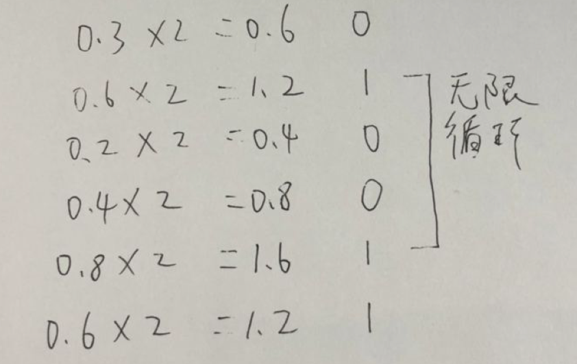
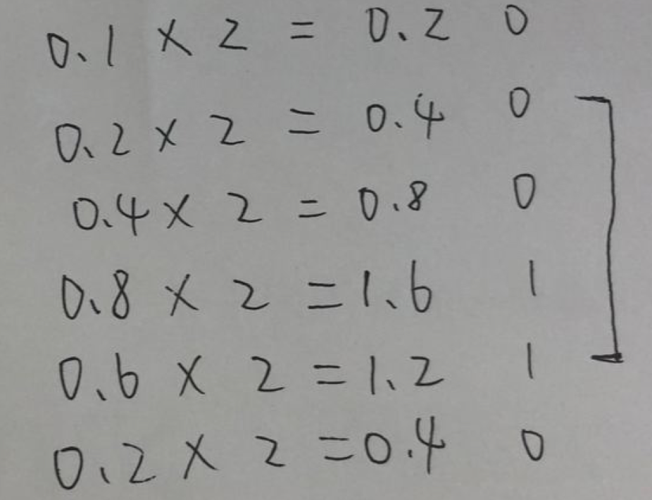
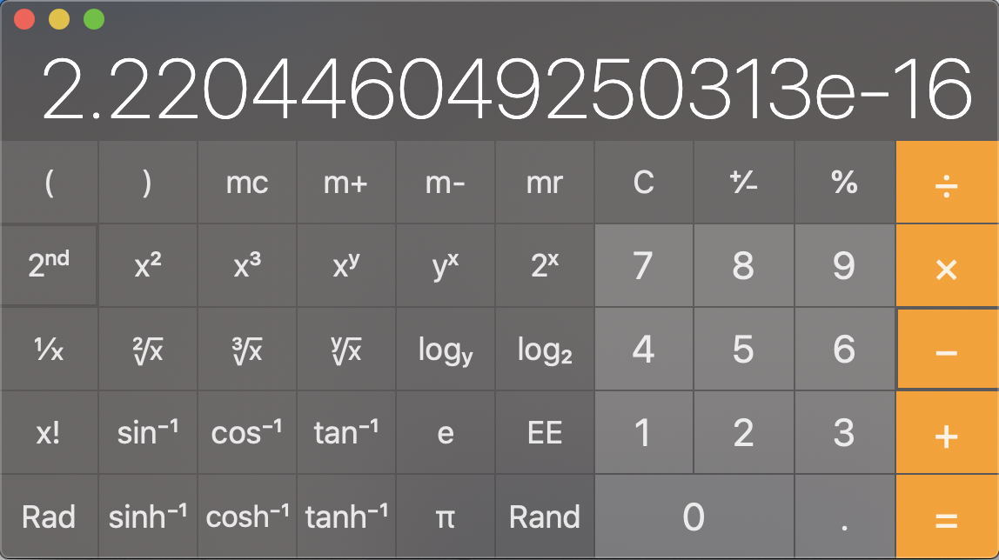

### 浮点数计算问题

##### 1. 前言

很多人都知道 js 里的 number 是以浮点数形式储存，遵循[IEEE 754 标准](https://en.wikipedia.org/wiki/IEEE_754)，所以在进行小数计算时会有一些误差，其实浮点数计算问题不止 js，其他语言也会有类似情况

举个 🌰：

可以看到 0.1+0.2 的结果并不是 0.3，0.1+0.7 也不是 0.8，是什么问题导致这些误差的呢？

##### 2. 问题原因

我们知道计算机只会进行二进制计算，所以十进制需要转换成二进制。但有一个问题，十进制小数部分如果转换成二进制，会存在**无限循环**的情况

比如：

0.3 转换为二进制

0.1 转换为二进制

二进制小数存在无限循环，而计算机的存储空间是有限的，不可能无限的存储下去，所以只能存储一部分长度，也就是说**无限循环部分会被截断**，存储起来的将会是一个**近似值**

> 在[IEEE 754 标准](https://en.wikipedia.org/wiki/IEEE_754)下小数部分长度最大为 52 位，如果第 53 位为 1 会进行四舍五入，其他情况会直接截断

也就是说 **0.1(十进制 0.1) ≈ 00111111 10111001 10011001 10011001 10011001 10011001 10011001 10011010(64 精度下储存的二进制 0.1)**

两个**近似值**相加得出来也会是一个**近似值**，自然会存在偏差

##### 3. 小数的最小精度

最小精度指的是最后一位上的单位值，也就是说要想知道小数最小精度，就必须找出**除 0 和负数外**最小的数

按照标准，小数长度最多为 52 位，小数位与整数位相反，越往右位数代表的数越小，所以小数位能表示的最小数为：

> 00000000 00000000 00000000 00000000 00000000 00000000 0001

也就是 2^-52(2 的-52 次方)，计算器里算出结果为

约为 2.22\*10^-16，也就是说精确到小数点后 15 位，加上个位有效位数为 16 位也就是最小精度

##### 4. 为什么 0.1+0.3 能得出 0.4？

上面说到近似值加近似值还是个近似值，那为什么 js 里大部分的小数加减乘除却能得到准确的数值，比如 0.1 + 0.3 === 0.4？

原因在于双精度浮点数是有最小精度的，只能精确到十进制小数点后 15 位，再往后就是不准确的了，而 js 用使用后 16 位进行四舍五入处理

- 理论上：0.1 + 0.3 ≈ 0.4
- 经过 16 位精度的四舍五入后：0.1 + 0.3 === 0.4

**结果的误差在 16 位之外**或者**四舍五入后得到正确的结果**，这就是大部分小数能够得出正确结果的原因
