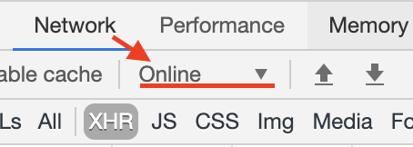

### redux-saga 中取消 fetch 请求

在阅读本篇文章前，建议先阅读[redux-saga 文档](https://redux-saga.js.org/)，理解基础用法

redux-saga 可以使用`cancel`取消任务，但并不能取消已经发起的请求。而`xhr`、`fetch`都提供了取消请求的方法，所以我们可以通过封装`fetch`，在取消任务的同时取消请求。

#### 关于 fetch 请求的取消

参考[AbortController](https://developer.mozilla.org/en-US/docs/Web/API/AbortController/AbortController)

#### 原理

yield 关键字在被取消时候会抛出错误，所以只需要用`generator`函数包住`fetch`请求，在里面通过`try catch`获取错误，最后取消请求

封装`fetch`：

```javascript
//fetch.js
function* fetchData(options) {
  const controller = new AbortController();

  try {
    return yield fetchDataWithoutCancel({
      ...options,
      signal: controller.signal
    });
  } finally {
    controller.abort();
  }
}
```

#### 实际运用

##### 与`takeLatest`结合使用：

```javascript
function* cancelFetchSaga() {
  yield takeLatest('CANCEL_FETCH', function*() {
    const data = yield call(fetchData, {
      url: 'http://httpstat.us/200?sleep=1000',
    }),

    console.log(data);
  });
}
```

每当执行`cancelFetch`任务，上一个未完成任务就会被取消，同时请求也会被取消

##### 使用`race`和`delay`实现超时取消请求：

```javascript
function* cancelFetchSaga() {
  yield takeLatest("CANCEL_FETCH", function*() {
    const { data, timeout } = yield race({
      data: call(fetchData, {
        url: "http://httpstat.us/200?sleep=2000"
      }),
      timeout: delay(1000)
    });

    if (timeout) {
      console.log("fetch canceled!");
    } else {
      console.log(data);
    }
  });
}
```

1s 后请求会被取消

#### 测试用工具

1. [httpstat](http://httpstat.us/)，可以自定义返回延迟

2. chrome network 里设置 throtting


