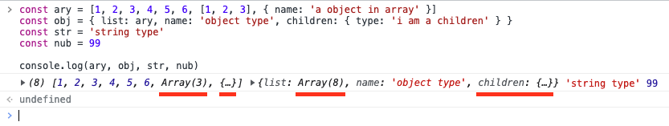
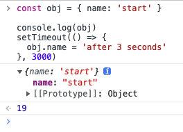
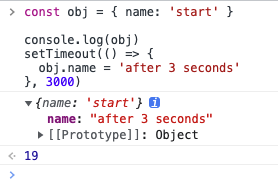

### 说谎的 console.log

#### 1、前言

`console.log`，前端在调试时用得最多的小伙伴，但你可能不知道，它有时候也会说谎

之所以要说这个，原因是最近修 🐛 时，无意中发现`console.log`断点调试输出与非断点输出不一致


#### 2、为什么 console.log 输出会不一致？

首先，我们要明确一个观念，`console.log`是同步的还是异步的？

理论上，`console.log`是同步的，他们实时输出数据，但在输出引用类型的数据，会有不同的行为



可以看到，引用类型数据如果存在嵌套时（图中红线），log 不会继续输出里面的数据，而是会省略

而且引用类型还可以**展开**，用来查看里面嵌套的数据，这是我们平时调试常用的动作

而`console.log`输出不一致的原因，就在于**展开**这个动作


之前`console.log`输出的数据并不完整，只能说是一种快照。而在展开时，则会往堆内存里拿最新的数据，这中间如果有对数据进行修改的话，就会出现异步的假象

举个 🌰

下面的代码，立即展开和三秒后展开会有不同的结果

```javascript
const obj = { name: "start" };

console.log(obj);

setTimeout(() => {
  obj.name = "after 3 seconds";
}, 3000);
```





回到最开始的问题，为什么断点和非断点调试，`console.log`输出会不一致

答案很明了，代码里存在对输出数据的修改，导致两次调试结果不一致。

而就结果来看，断点调试的输出才是正确的，也是我们想要的（都断点了，谁还看 log 呀）。

#### 3、为什么会这么设计？

主要原因在于引用类型会存在**循环引用**的情况，一次性打印出来的话就会死循环，而如果缓存数据，则会占用资源

注意：以上测试与结论都基于 chrome 浏览器，不同浏览器实现可能不一样

#### 4、总结

`console.log`在打印引用类型时，会立马输出当前的快照，并会省略嵌套的引用类型数据。而后面**展开**数据时，会往堆里拿取最新数据，同时也会缓存起来（后续开关不会更新数据）

并不只是`console.log`有这个特性，只要是涉及**展开**这个动作，就会存在


了解这个特性可以让我们 debug 少走弯路，但有一点要明白，最好的 debug 方法还得是**断点**

除此之外，良好的代码习惯也是必不可少的（前言里的问题是因为在 react 里直接修改 state，然后使用 forceUpdate 进行 render 导致，我真是佩服写出这个的老哥）
