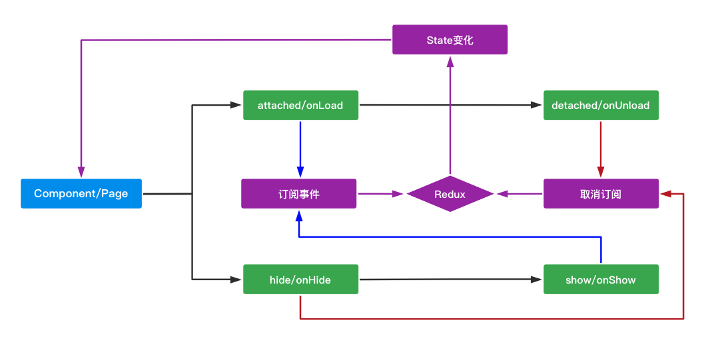
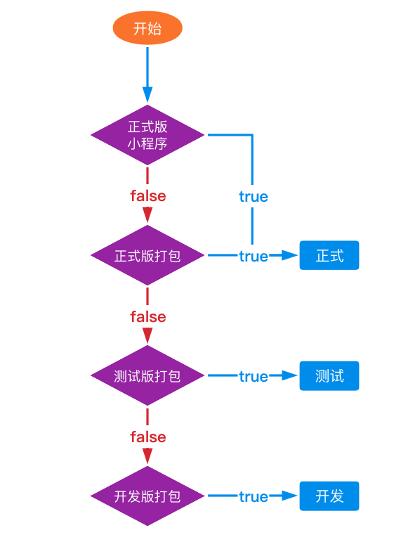
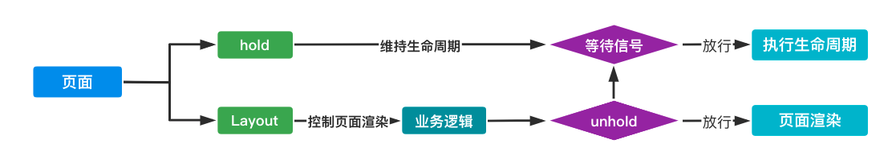
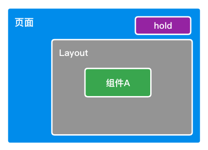
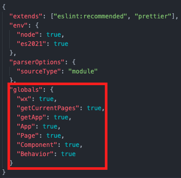

## 小程序开发经验分享

这里主要是分享小程序开发时遇到的问题，以及解决方案。

### 1. 小程序的缺点

#### 1.1 `npm`支持不完全

小程序只支持纯 js 库，而且必须有主入口（需要指定 main），[相关文档](https://developers.weixin.qq.com/miniprogram/dev/devtools/npm.html)。

只要用到 babel 编译的库，都没办法直接引入到小程序里，必须手动引入构建后的包才行，但这样就失去 npm 版本管理的意义。

#### 1.2 缺少状态管理

这里是指缺少类似于 redux、vuex、mobx 的能力，状态管理是开发大型项目必不可少的需求。

小程序的 [storage](https://developers.weixin.qq.com/miniprogram/dev/api/storage/wx.getStorage.html) 与 localStorage 类似，没有响应变化的能力。

#### 1.3 缺少环境变量

环境变量主要是用来区分开发、测试、正式这三种，也可以决定一些库是否导入或使用。

小程序只能区分开发版、体验版、正式版，但把它们对标开发、测试、正式不太好，因为我们可能会在开发者工具里调试开发、测试、正式三种环境。

#### 1.4 不会处理`cookies`

小程序请求时不会自动带上 cookies，返回的 reponse 里虽然有 cookies，但不会自动储存。

#### 1.5 入口很多，缺少控制层

小程序启动时，[App](https://developers.weixin.qq.com/miniprogram/dev/reference/api/App.html) 的生命周期虽然第一个执行，但它不能阻塞其他页面，这意味它不能作为项目里的控制层（比如：登录完成前显示 loading，不显示页面）。

而且小程序的路由是平铺开来的，如果要做登录拦截，有多少个路由，就要写多少个拦截。

### 2. 如何应对

#### 2.1 自己打包

既然要保留版本管理，又要构建，那我们自己打包输出到`miniprogram_npm`不就可以了。

因为只用输出纯 js，所以我们选用 rollup 来打包。

除此之外，使用`yarn workspaces`来管理本地依赖（这里我们直接打包到`miniprogram_npm`，这点可有可无。主要是方便指令控制，以及项目分类）。

这一步十分重要，是下面两个应对的前提！

#### 2.2 引入 redux

在讲之前，我们先要知道**Component 是可以作为 Page 使用的**，而且**Component 的功能比 Page 更为强大**（Page 属于遗留产物，很鸡肋）。

引入 redux 就需要 connect，小程序没有现成，所以我们得自行封装。有两种思路，一个是[behaviors](https://developers.weixin.qq.com/miniprogram/dev/reference/api/Behavior.html)，另一个是[Component](https://developers.weixin.qq.com/miniprogram/dev/framework/custom-component/component.html)，原理都是劫持生命周期，注入 redux 订阅事件。



因为我们用到[redux-saga](https://redux-saga.js.org/docs/introduction/GettingStarted)做异步处理，里面带有`generator function`，所以打包时需要引入`@babel/plugin-transform-runtime`。

> babel7 里的`@babel/env`只提供语法支持，api 则是由`runtime`提供

注意：redux 里有使用到`process.env.NODE_ENV`环境变量，这个在下面会一并解决。

#### 2.3 自定义环境变量

打包脚本上挂载环境变量，rollup 打包中统一替换。

```javascript
//package.json
"scripts": {
  "start": "RUNNER_ENV=dev runner-scripts",
  "build": "RUNNER_ENV=prod runner-scripts"
},

//rollup.config.js
replace({
  'process.env.NODE_ENV': JSON.stringify(env),
  preventAssignment: true,
}),
```

接下来是环境区分，建议打包环境与[wx.getAccountInfoSync](https://developers.weixin.qq.com/miniprogram/dev/api/open-api/account-info/wx.getAccountInfoSync.html)结合使用，下面是我项目里的环境区分。



这样写的好处有两点：

- 配置灵活，本地可以调试任意环境
- 可以使用测试环境提审，发布后自动转变成正式环境，能与后端同时上线

#### 2.4 封装请求

这个好说，小程序 storage 可以持续化储存，从 response 的 header 里取出`Set-Cookie`，再放进 storage 里这样就实现 cookies 的存储。

在请求之前，从 storage 获取 cookies，并带在 header 的 Cookies 上即可。

需要注意的是，正常 cookies 会有**过期时间**，存储时需要把 expires 和 max-age 一起存进去，获取时校验 cookies 是否过期。

#### 2.5 维持生命周期

关于控制层方面，小程序没有解决方案，只能在需要控制的页面上增加控制的逻辑，但我们可以把这一层抽象出来，减少重复代码。

思路：组件 Layout 控制页面是否渲染，hold（一个 Behavior）通过劫持页面来维持生命周期，直到 Layout 发出通行的信号才执行。通过控制生命周期和页面渲染，达到控制页面的效果，同时组件与 Behavior 都能复用，减少重复率。



BUG：开发时发现页面内组件的生命周期无法维持，需要增加`wx:if="{{!HOLDING}}"`



### 3. 最后

#### 3.1 关于 eslint



如果使用 eslint，请指定使用到的微信 api，因为编辑器不知道微信的全局 api 有那些，会直接报错。

#### 3.2 canvas 绘制

如果手动绘制海报，注意将文案的对齐方式（textBaseline）设置为 middle，y 轴定位加上一半行高即可

#### 3.3 js 支持

在开发前最好看下[JavaScript 支持情况](https://developers.weixin.qq.com/miniprogram/dev/framework/runtime/js-support.html)

举个例子，其中小程序禁用`eval`和`new Function`，`@babel/plugin-transform-runtime`在编译后会有 Function 代码导致报错，详细见[issues](https://github.com/facebook/regenerator/issues/378)
