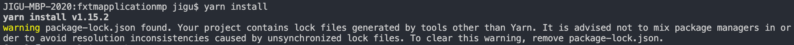

### 如何处理 package-lock.json 与 yarn.lock

#### 1、前言

`package-lock.json`与`yarn.lock`分别是`npm`和`yarn`在安装依赖后自动生成的文件，用来记录安装依赖的具体版本

每当执行`npm install`和`yarn install`都会去创建或更新 lock 文件，将变更提交到 git 后经常会导致 merge，所以有些人会把 lock 文件写进.gitignore 里，**但这个行为是有风险的**

#### 2、举个 🌰：

你独自负责一个项目，开发了几年，项目稳定，依赖也一直没有出现问题。某天项目扩招，来了个新同事，你十分开心，心想自己可以轻松一些了，但新同事在`yarn install`后，**提示了好几个警告，项目也跑不起来**

再来一个 🌰：

一个项目几年没动过，某天领导要求你去开发个小需求。半天不到你就搞定了，本地验证完成，提交代码至 dev，等待 ci 然后验证，心里暗想又可以滑几天水。但你突然发现 ci **没跑过**（又或者是**效果不对**）

问题在于依赖版本变更，新同事和 ci 上安装的依赖与你本地的依赖版本不同，导致结果有出入

上面例子出现的可能性低，但这些问题是确实存在的，而且随着时间推移，可能性就越大（本人遇到过第二种情况）

#### 3、那么我们该如何避免这些问题？

简而言之，你需要**锁死依赖版本**，并不是在 package.json 里指定依赖版本，而是让**依赖安装时以 lock 文件为主**

首先**保证 lock 文件提交到远程仓库**（lock 文件只能提供信息，并没有锁死版本的功能），然后你需要使用`npm ci`和`yarn install --frozen-lockfile`**安装依赖**（这些指令会根据 lock 文件安装依赖，当 lock 文件不存在或者 lock 文件与 package.json 有出入时会抛出错误）

#### 4、约束：

上面说的都是规范，规范如果不被认可不被准守，那就没有意义，所以需要约束

1. 用 yarn 还是用 npm？

用哪个都可以，甚至可以两个都用，但需要同时维护`package-lock.json`与`yarn.lock`，可以使用`yarn import`或[synp](https://github.com/imsnif/synp)将 lock 文件进行转换，`postinstall` 里设置好转换的脚本

不建议同时维护两种，没啥好处，反而增加麻烦，而且混合使用会有警告提示

2. 如何让团队成员只用 yarn 或 npm？

还真有，可以看下这个 => [Force yarn install instead of npm install for Node module?](https://stackoverflow.com/questions/41076172/force-yarn-install-instead-of-npm-install-for-node-module)，推荐使用[only-allow](https://github.com/pnpm/only-allow)

3. 能不能让`npm install`和`yarn install`默认锁版本，不更新 lock 文件？

添加`--install.frozen-lockfile true`到`.yarnrc`，可以让`--frozen-lockfile`成为`yarn install`的默认参数

`npm install`没办法做到 yarn 那样

#### 5、总结

最后总结下最佳实践流程：

1、请**务必将 lock 文件提交至远程**，为了自己也为了后面接手的同事（后面同事接手项目跑不起来，翻 git 记录也没有 lock 文件，就会很难受）

2、从 yarn、npm 中选择一个作为包管理器（建议 yarn），并用[only-allow](https://github.com/pnpm/only-allow)进行限制

3、如果是 yarn，请添加`--install.frozen-lockfile true`到`.yarnrc`。npm 可以在团队内约定统一使用`npm ci`

4、**定期升级版本**，旧版本可能藏雷，定期升级可以在遇到之前排除
