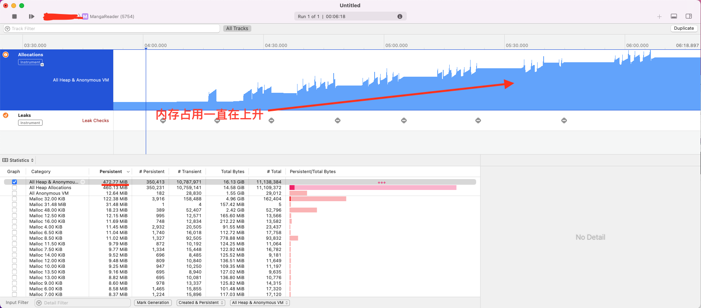
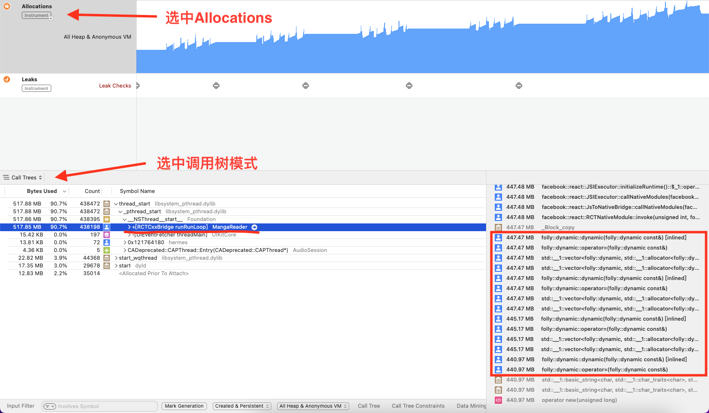
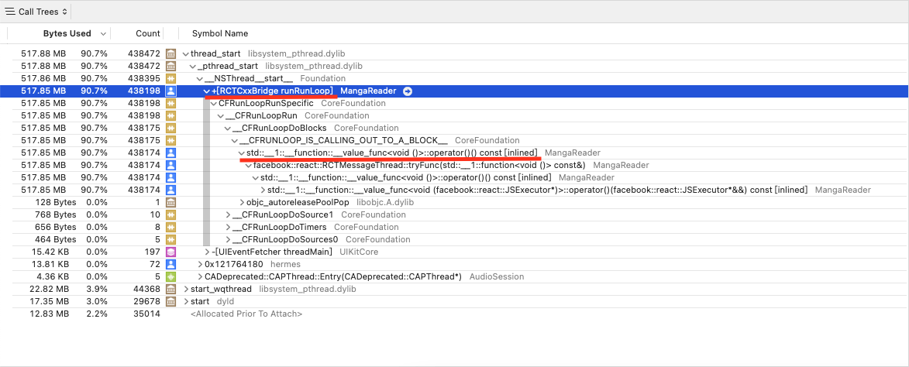
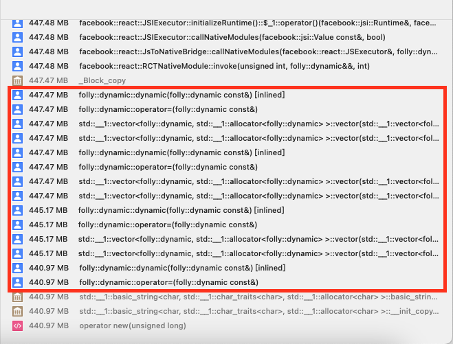
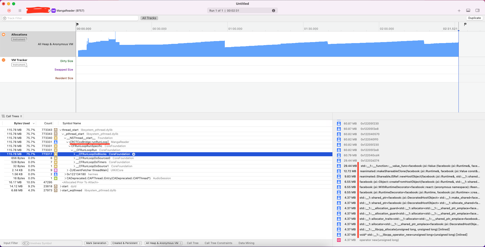
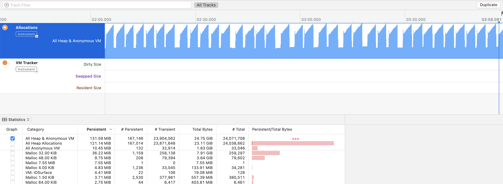

### 前言

这篇文章主要是记录我第一次在 **React-Native** 上遇到的内存泄露问题，以及我是**如何复现、定位和解决**的

这个问题是一个网友发现的，他在 Github 上提了个 **[issues](https://github.com/youniaogu/MangaReader/issues/72)**，说自己使用**批量更新**在 200 本漫画更新至 130 本左右时**应用闪退**，并出现下面这些报错

```
MangaReader[34387:6766278] [javascript] ┘
W1105 14:09:47.729962 1810935808 JSIExecutor.cpp:378] Memory warning (pressure level: 1) received by JS VM, unrecognized pressure level
```

可以看到这个警告是在说**应用内存占用过高**，结合他说的应用闪退，很可能是因为**内存泄露导致内存占用太高，最后进程被系统强制关闭**

在初步确认问题后，要开始想办法复现问题

### 复现问题

他在 v0.6.3 版本遇到这个问题，更新至 v0.6.6（最新版）问题依旧存在，然后使用的是平板并且是 ipados v16.3.1

我没有平板，模拟器和手机都还是 ios v15，所以有可能无法复现

开始我用自己添加的 420 本漫画进行测试，**没有遇到闪退**，怀疑可能测试数据不对，于是找网友要备份数据，但也没能复现


图片有点模糊，但从最左边的 **RAM** 可以看到，更新完后内存稳定在 **500M** 左右，没有遇到闪退的问题（**这里虽然没有闪退，但已经存在内存泄露，只不过运气好没溢出而已，后面会解释**）


然后网友提供的视频录制里可以看到 RAM 已经去到了 **1600M**，下一秒应用进程就被杀死然后闪退

没能复现，我开始怀疑是不是 OS 问题，于是我去谷歌搜索相关内容，我甚至还检查了备份数据内容，但都没能发现有用的信息

### 定位问题

虽然没能复现问题，但我很确定这是内存泄露，所以我决定**跳过问题复现**，直接**检测内存泄露**，用的工具是 Xcode 的 Instruments

下面是我第一次的**内存泄露**和**内存分配**的检测截图



可以看到内存占用一直在增加，从最开始的 **50M 飙到了 500M**，中间有内存回收的迹象，但总体是在上升的，是**很明显的内存泄露**，**但 Leaks 却没有提示**



既然 Leaks 没能检测出泄露，那么我只能自己在**内存分配里查找线索**，**注意蓝色的用户图标，它代表这部分是我们创建的代码**



注意横线部分关键字，bridge 应该是指负责 native 和 js 通信的部分，const 是 js 定义变量关键字，表明我们定义了一个 **517M** 的变量通过 bridge 传给了 native



右下角里可以看到有 dynamic const 的关键字，这很可能是在说我们定义了一个 **447M** 的变量，并且这个变量一直没有回收

最后综合分析一下，在批量更新过程中，我们定义了一个很大的变量交给 native，这个变量没有回收导致内存泄露，再结合代码中的业务逻辑，可以发现问题出在**数据同步**上面

### 解决问题

接下来说的内容涉及业务相关的，如果不感兴趣可以跳到 **[总结](#总结)** 部分

为什么可以断定是数据同步，因为数据同步符合上面提到的特征

- 批量更新会加载漫画详情数据，**加载完成后会触发数据同步**
- 数据同步会处理 Redux 里的数据，所以会**定义很大的变量**
- 数据同步会把这些数据**传给 native 并存在本地**

接下来要**确认和定位问题**，方法很简单，用**排除法**把相关代码注释再去看内存分配情况

下面是注释**数据同步**后的**内存分配检测截图**



可以看到**内存变化很平稳**，虽然内存一直在增大，但内存最高只有 **170M**，同时有内存回收迹象

右下角也看不到上一个测试里的大变量，很显然**问题就出数据同步**

接下来我们需要再进一步的**定位到具体代码**，这一步我是**基于业务和主观猜测**找出来了

我重构了数据同步，并**删除了数据同步的打断逻辑**，因为我觉得**频繁打断数据同步**会造成任务中定义的**备份数据内存泄露**

然后下面是**最终的内存分配检测截图**



我们可以看到**一座座美丽的内存回收小山**！

### 总结

至此内存泄露问题已经解决，但这过程中我也犯了一些**小错误**

其中我因为缺乏内存泄露的处理经验，**错误判断了复现结果**

最开始尝试复现的时候，我想复现应用闪退（内存溢出导致进程被杀死），但实际上只要不是**长时间运行**或者**重复大量操作**，**内存泄露不一定会导致内存溢出**

所以第一次复现时已经成功了，只不过我的**关注点错了**，以至于后面我的关注点偏到备份数据和 OS 上面

最后还有个**小疑问**，为什么**同样的备份数据**，网友会**内存溢出闪退**，而我却不会？

事实上是因为**网速不同**！

这些内存泄露的**直接原因**是数据同步被**打断**，导致中间生成的备份数据没法被释放，所以**越频繁的打断数据同步**，造成**内存泄露量就越大**！

而我用的**代理比较差**，漫画**加载速度比较慢**，数据同步任务**被打断次数较少**，所以**内存泄露量也较少**，最终结果就是同样的备份数据，我这边复现操作不会闪退
